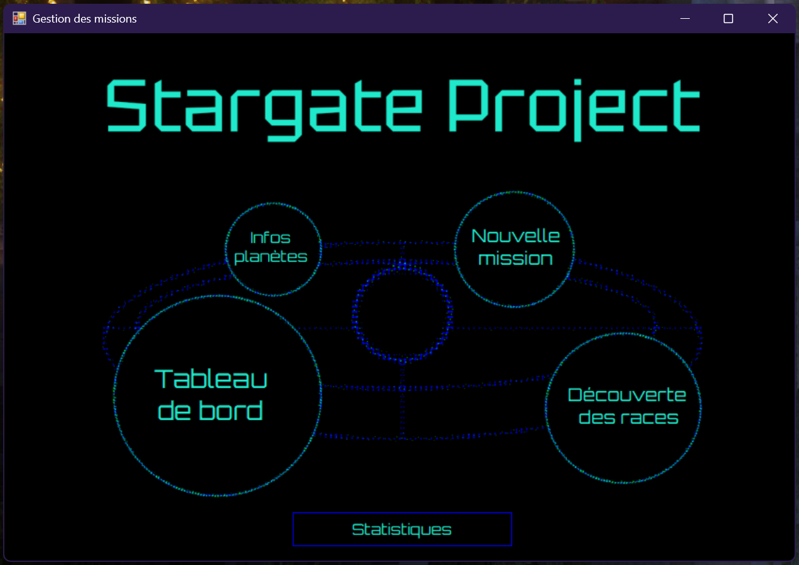
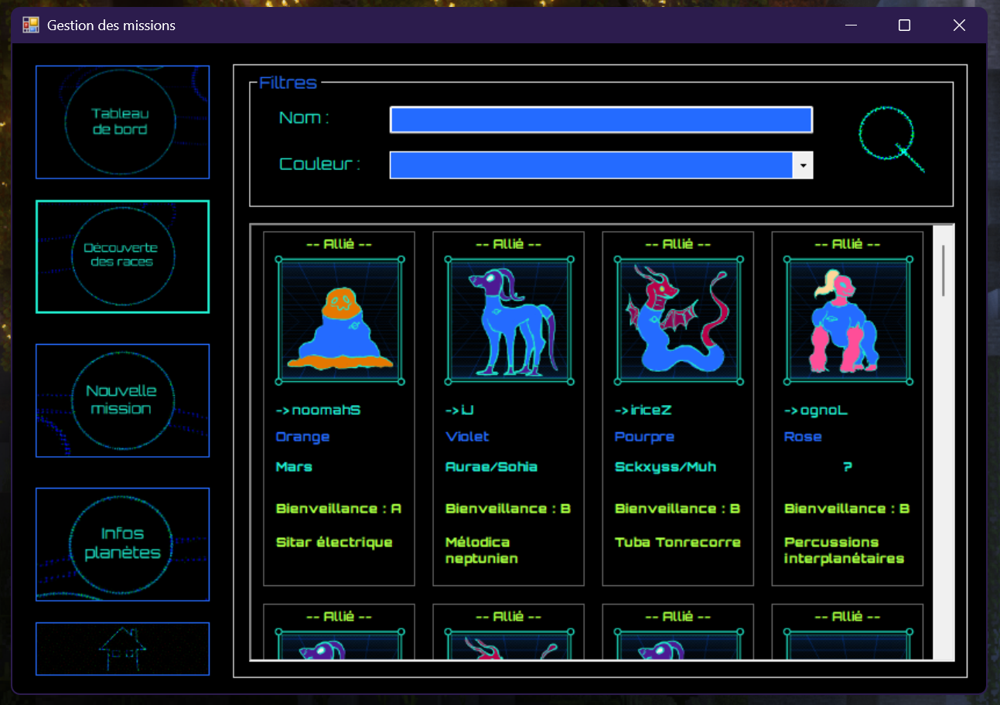
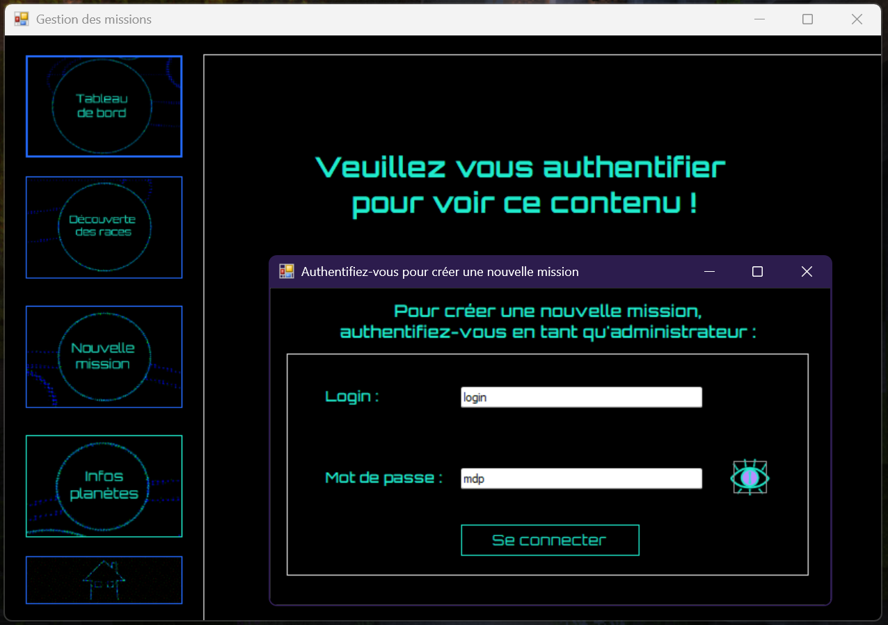
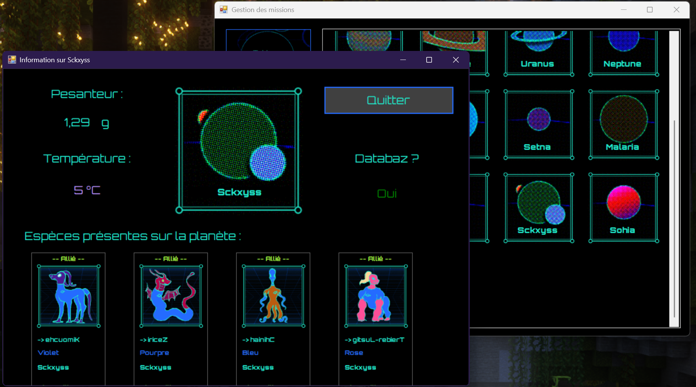
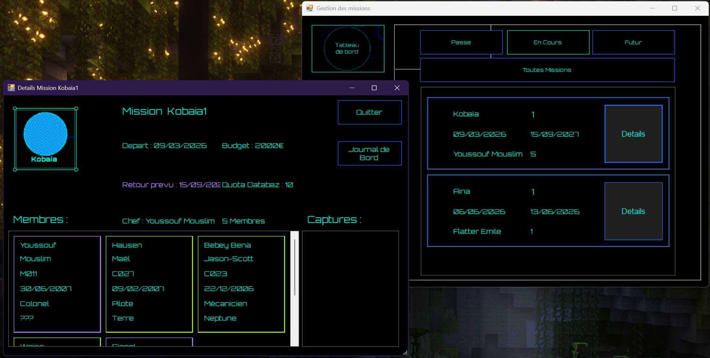

# 🚀 Stargate — Gestion des Missions

Application de bureau **C# / Windows Forms** inspirée de l'univers Stargate, permettant de gérer des espèces extraterrestres, des planètes et la composition de missions intergalactiques, avec authentification administrateur.

---

## 📸 Aperçu



| Découverte des races | Infos planète |
|:---:|:---:|
|  |  |

| Authentification | Gestion des missions |
|:---:|:---:|
|  |  |

---

## ✨ Fonctionnalités

- 🛸 **Tableau de bord** — vue d'ensemble des missions (passées, en cours, à venir)
- 👽 **Découverte des races** — exploration des espèces extraterrestres avec filtres par nom et couleur (alliés en vert, ennemis en violet)
- 🌍 **Infos planètes** — fiche détaillée de chaque planète (gravité, température, présence DataBaz, espèces habitant la planète)
- 🔐 **Authentification** — accès à la création de missions réservé aux administrateurs
- 📋 **Gestion des missions** — création, composition d'équipe, suivi du budget et journal de bord
- 📊 **Statistiques** — coéquipiers par membre et suivi budgétaire des missions

---

## ⚙️ Installation & Exécution

### Prérequis
- Windows
- [Visual Studio 2019+](https://visualstudio.microsoft.com/)
- .NET Framework 4.x
- Package NuGet : `System.Data.SQLite`

### Lancer le projet

1. **Cloner le dépôt**
   ```bash
   git clone https://github.com/Amandine-Miranda/Stargate-Aliens-WindowsFormProject.git
   ```

2. **Ouvrir la solution** dans Visual Studio
   ```
   SAE24STARGATE.slnx
   ```

3. **Restaurer les packages NuGet**
   > Clic droit sur la solution → *Restaurer les packages NuGet*

4. **Lancer l'application**
   > Appuyer sur `F5` ou cliquer sur **Démarrer**

> ⚠️ Le fichier `Stargate.db` et le dossier `Resources/` doivent être présents à la racine du projet pour que l'application fonctionne correctement.

---

## 🛠️ Stack technique

- **C#** — Windows Forms
- **SQLite** — base de données locale (`System.Data.SQLite`)
- **Visual Studio** — environnement de développement

---

## 📄 Licence

Ce projet est sous licence [MIT](LICENSE).
